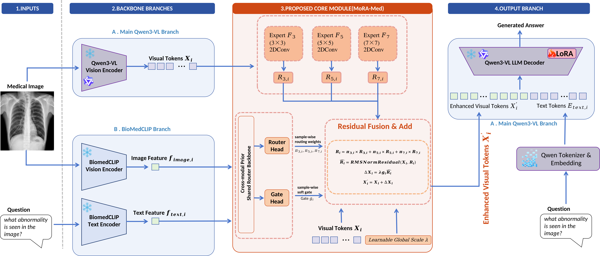
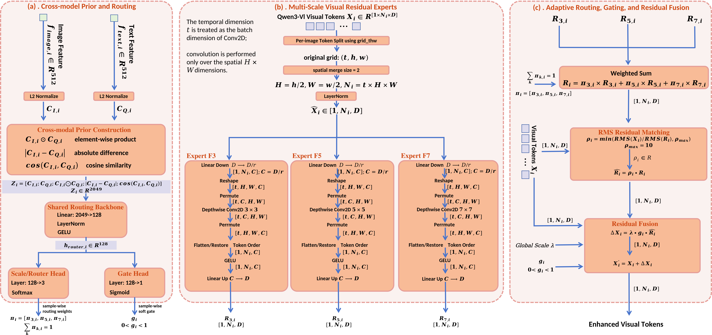
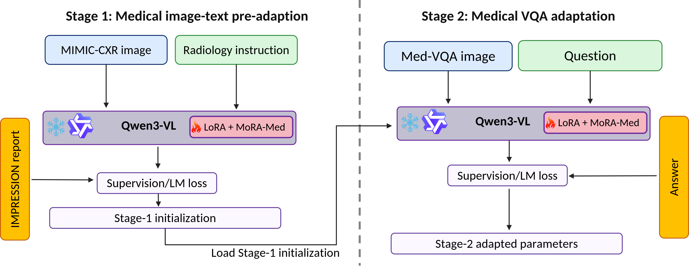

<div align="center">

# MoRA-Med

### Question-Conditioned Multi-Scale Residual Adaptation for Medical Visual Question Answering

**MoRA-Med** = **Medical-oriented Routing and Residual Adaptation for Medical VQA**

Yuqing Zhou · Pengfei Xu · Qihui Sun · Feng Yan

<p>
  
  
  
  
</p>

<!-- TODO after public release:
[Paper] · [Checkpoints] · [Project Page] · [License]
-->

</div>

## Overview

**MoRA-Med** is a parameter-efficient framework for medical visual question answering (Med-VQA).  
Instead of relying only on low-rank weight adaptation, MoRA-Med explicitly adapts the **frozen visual-token representation** of a pretrained multimodal large language model using lightweight, question-conditioned residual updates.

The current implementation uses:

- **Qwen3-VL-8B-Instruct** as the frozen multimodal backbone.
- **LoRA** for parameter-efficient adaptation of the language/model projections.
- A frozen **BiomedCLIP-PubMedBERT_256-vit_base_patch16_224** model to construct a biomedical image-question prior.
- Three multi-scale residual experts with **3×3, 5×5, and 7×7** depthwise convolutions.
- A question-conditioned **Router** to adaptively combine the residual experts.
- A sample-wise **Gate** and bounded learnable global scale to control residual injection.
- **RMS residual matching** to stabilize the scale of the injected update.
- A **two-stage adaptation strategy**: MIMIC-CXR pre-adaptation followed by downstream Med-VQA adaptation.

<p align="center">
  
</p>

<p align="center">
  <em>Overall architecture of MoRA-Med.</em>
</p>

## Highlights

- **Question-conditioned visual adaptation.** The residual update depends on the current image-question pair rather than using a fixed visual transformation.
- **Adaptive multi-scale routing.** Three receptive-field experts are softly combined through sample-specific routing weights.
- **Controlled residual injection.** A learned Gate, bounded global scale, and RMS matching regulate how strongly the adapted residual modifies frozen visual tokens.
- **Parameter efficiency.** The MoRA-Med visual branch adds **6.58M trainable parameters**, corresponding to only **3.77%** over the LoRA-only baseline.
- **Paired multi-seed evaluation.** Experiments use seeds **1024, 2048, and 4096** under matched Stage-1/Stage-2 conditions.

## Method

### Detailed Visual Adaptation Module

<p align="center">
  
</p>

<p align="center">
  <em>Detailed architecture of the MoRA-Med visual adaptation module.</em>
</p>

MoRA-Med contains three main components.

### 1. BiomedCLIP-conditioned cross-modal prior

For each image-question pair, frozen BiomedCLIP image and text encoders produce normalized modality-specific embeddings. The routing prior concatenates:

- image features,
- text features,
- element-wise image-text interactions,
- absolute image-text differences,
- cosine similarity.

The resulting prior is processed by a shared routing backbone and mapped to:

- a three-way routing distribution over the multi-scale experts, and
- a sample-wise residual Gate.

### 2. Multi-scale visual residual experts

The frozen Qwen3-VL visual tokens are passed through three lightweight bottleneck residual experts with spatial kernels:

| Expert | Kernel | Role |
|---|---:|---|
| F3 | 3×3 | Fine/local receptive field |
| F5 | 5×5 | Intermediate receptive field |
| F7 | 7×7 | Wider receptive field |

The implementation uses a visual hidden dimension of **4096** and a bottleneck ratio of **16**, giving a latent expert dimension of **256**.

### 3. Adaptive routing, gating, and residual fusion

The Router predicts sample-specific soft weights over F3/F5/F7. The routed residual is then stabilized with RMS residual matching and modulated by:

- sample-wise Gate `g`,
- bounded learnable global scale `lambda`.

The adapted representation preserves the pretrained visual stream through an identity residual connection.

## Two-Stage Training

<p align="center">
  
</p>

<p align="center">
  <em>Two-stage parameter-efficient adaptation pipeline.</em>
</p>

### Stage 1: Medical image-text pre-adaptation

Stage 1 uses a fixed **160k-image MIMIC-CXR** subset. A chest X-ray image and a fixed radiology instruction form the model input, while the corresponding **IMPRESSION** report section is used as autoregressive supervision.

Only the LoRA and MoRA-Med parameters are optimized. The base Qwen3-VL model and BiomedCLIP remain frozen.

### Stage 2: Medical VQA adaptation

The Stage-1 initialization is transferred to one of four downstream benchmarks:

- SLAKE
- VQA-RAD
- VQA-Med 2019
- VQA-Med 2021

Each Stage-2 run continues optimizing the parameter-efficient components while keeping Qwen3-VL and BiomedCLIP frozen.

## Main Results

Overall Accuracy (%) over three paired training seeds:

| Dataset | LoRA baseline (A0) | MoRA-Med (A6) | Paired gain | Positive seeds |
|---|---:|---:|---:|---:|
| SLAKE | 87.44 ± 0.51 | **89.40 ± 0.65** | **+1.96 ± 0.57** | 3/3 |
| VQA-RAD | 60.90 ± 0.34 | **62.60 ± 0.56** | **+1.70 ± 0.90** | 3/3 |
| VQA-Med 2019 | 63.80 ± 0.35 | 63.93 ± 1.22 | +0.13 ± 0.90 | 2/3 |
| VQA-Med 2021 | 17.27 ± 3.13 | 17.80 ± 1.06 | +0.53 ± 2.10 | 2/3 |

MoRA-Med shows the clearest and most consistent gains on **SLAKE** and **VQA-RAD**. Performance is largely preserved on **VQA-Med 2019**, while **VQA-Med 2021** shows a modest positive mean change with stronger seed sensitivity.

## Parameter Efficiency

| Model / component | Trainable parameters | Increment vs. A0 |
|---|---:|---:|
| A0: Qwen3-VL + LoRA | 174,587,904 | — |
| MoRA-Med visual branch | 6,584,069 | +6,584,069 |
| A6: Full MoRA-Med | 181,171,973 | **+3.77%** |

> The numbers above describe **trainable-parameter efficiency**, not total runtime cost. BiomedCLIP remains frozen but is still executed to construct the cross-modal prior, and the residual experts/Router/Gate introduce additional computation.

## Ablation Configurations

The repository contains the controlled A0-A6 ablation family used in the paper:

| ID | Configuration |
|---|---|
| A0 | Pure LoRA baseline |
| A1 | MoRA-Med without discriminative learning rates (DLR) |
| A2 | MoRA-Med without RMS residual matching |
| A3 | MoRA-Med with fixed `lambda = 0.9` |
| A4 | MoRA-Med with fixed `g = 0.5` |
| A5 | MoRA-Med with uniform routing weights `(1/3, 1/3, 1/3)` |
| A6 | Full MoRA-Med |

## Repository Structure

```text
MoRA_Med/
├── figures/
│   ├── framework.png
│   ├── framerwork_detail.png
│   └── two_stage_training.png
├── config/
│   ├── LLM_config.py
│   ├── stage1_train_config_mimic_cxr.py
│   ├── slake/
│   ├── vqa_rad/
│   ├── vqa_med_2019/
│   └── vqa_med_2021/
├── datas/
│   ├── mimic_cxr_datasets.py
│   ├── slake_datasets.py
│   ├── vqa_rad_datasets.py
│   ├── vqa_med_2019_datasets.py
│   └── vqa_med_2021_datasets.py
├── training/
│   ├── stage1_trainer_mimic_cxr.py
│   ├── stage2_trainer_slake.py
│   ├── stage2_trainer_vqa_rad.py
│   ├── stage2_trainer_vqa_med_2019.py
│   └── stage2_trainer_vqa_med_2021.py
├── evaling/
│   ├── stage2_validate_checkpoints_slake.py
│   ├── stage2_test_checkpoints_slake.py
│   ├── stage2_validate_checkpoints_vqa_med_2019.py
│   ├── stage2_test_checkpoints_vqa_med_2019.py
│   ├── stage2_validate_checkpoints_vqa_med_2021.py
│   ├── stage2_test_checkpoints_vqa_med_2021.py
│   └── stage2_test_checkpoints_vqa_rad.py
├── utils/
│   ├── biomedclip/
│   ├── data_tools/
│   ├── ddp/
│   ├── qwen3vl/
│   └── training/
├── LLM_api/
│   ├── deepseek.py
│   └── prompts/
└── other/
    ├── generate_mimic_cxr_cache.py
    ├── generate_mimic_cxr_cache_subset_same_format.py
    ├── generate_test_official_jsonl.py
    ├── generate_vqa_med_2021_jsonl.py
    └── ...
```

> `evaling/` is the directory name used by the current code release.

## Installation

### 1. Clone the repository

```bash
git clone <YOUR_REPOSITORY_URL>
cd MoRA_Med
```

### 2. Create an environment

The repository does not yet pin exact package versions. The current code depends on PyTorch/Hugging Face PEFT tooling, bitsandbytes quantization, OpenCLIP, and FlashAttention.

A minimal starting point is:

```bash
pip install \
  torch torchvision \
  transformers accelerate peft \
  bitsandbytes safetensors \
  open-clip-torch \
  pillow numpy tqdm \
  openai requests
```

The default Qwen3-VL configuration uses:

```text
attn_implementation = "flash_attention_2"
```

Install FlashAttention if your CUDA/PyTorch environment supports it:

```bash
pip install flash-attn --no-build-isolation
```

If FlashAttention is unavailable, change `attn_implementation` in the corresponding config file to a supported alternative such as `sdpa` or `eager`.

> Before the public release, we recommend adding a pinned `requirements.txt` or `environment.yml` generated from the final reproducibility environment.

## Model Preparation

The current implementation expects local model directories.

### Qwen3-VL

Use:

```text
Qwen3-VL-8B-Instruct
```

and update `model_name_or_path` in the training/evaluation config files.

### BiomedCLIP

Use the frozen checkpoint:

```text
BiomedCLIP-PubMedBERT_256-vit_base_patch16_224
```

and update `biomedclip_path` in the corresponding config files.

The BiomedCLIP loader expects a local checkpoint directory containing the OpenCLIP configuration/weights and the matching PubMedBERT tokenizer files.

## Data Preparation

The current release uses explicit local paths in the config files. **Update all dataset/model/output paths before training.**

### MIMIC-CXR-JPG v2.1.0

Stage 1 expects a layout containing:

```text
mimic-cxr-jpg-2.1.0/
├── mimic-cxr-2.0.0-metadata.csv.gz
├── files/
├── reports/
└── cache/
```

The paper uses a fixed 160k-study subset sampled with data-sampling seed `2048`, followed by deterministic selection of one image per selected study. The `IMPRESSION` section is used as the supervision target.

Relevant helpers:

```text
other/generate_mimic_cxr_cache.py
other/generate_mimic_cxr_cache_subset_same_format.py
```

### SLAKE

Expected layout:

```text
SLAKE/Slake1.0/
├── train.json
├── validate.json
├── test.json
└── imgs/
```

### VQA-RAD

Expected layout:

```text
VQA-RAD/
├── train.jsonl
├── test_official.jsonl
└── images/
```

A helper for constructing the official test JSONL is provided in:

```text
other/generate_test_official_jsonl.py
```

### VQA-Med 2019

The current config expects the original ImageCLEF-style directory structure:

```text
VQA-Med-2019/
├── train/
│   └── ImageClef-2019-VQA-Med-Training/
│       ├── QAPairsByCategory/
│       └── Train_images/
├── val/
│   └── ImageClef-2019-VQA-Med-Validation/
│       ├── QAPairsByCategory/
│       └── Val_images/
└── test/
    └── VQAMed2019Test/
        ├── VQAMed2019_Test_Questions_w_Ref_Answers.txt
        └── Test_images/
```

### VQA-Med 2021

The current pipeline consumes:

```text
VQA-Med-2021/jsonl/
├── train.jsonl
├── validation.jsonl
└── test.jsonl
```

Expected sample counts are:

- train: 4,500
- validation: 500
- test: 500

A conversion/checking pipeline is provided in:

```text
other/generate_vqa_med_2021_jsonl.py
other/check_vqa_med_2021.py
other/check_vqa_med_2021_collator.py
```

## Configuration

Before running experiments, update the local paths in:

```text
config/stage1_train_config_mimic_cxr.py
config/slake/stage2_train_config_slake.py
config/vqa_rad/stage2_train_config_vqa_rad.py
config/vqa_med_2019/stage2_train_config_vqa_med_2019.py
config/vqa_med_2021/stage2_train_config_vqa_med_2021.py
```

At minimum, verify:

- `output_root`
- dataset paths
- `model_name_or_path`
- `biomedclip_path`
- seed / Stage-1 seed
- ablation ID

## Training

The training scripts are compatible with Hugging Face `Trainer` and are written to support distributed execution through `torchrun`.

Replace `<N>` with the number of GPUs to use.

### Stage 1: MIMIC-CXR

Full MoRA-Med:

```bash
torchrun --nproc_per_node=<N> \
  training/stage1_trainer_mimic_cxr.py \
  --ablation_id A6 \
  --seed 2048
```

LoRA-only baseline:

```bash
torchrun --nproc_per_node=<N> \
  training/stage1_trainer_mimic_cxr.py \
  --ablation_id A0 \
  --seed 2048
```

For the paired multi-seed protocol, repeat with:

```text
1024, 2048, 4096
```

### Stage 2: SLAKE

The current SLAKE Stage-2 config stores `seed`, `stage1_seed`, and `ablation_id` directly in:

```text
config/slake/stage2_train_config_slake.py
```

Set those fields first, then run:

```bash
torchrun --nproc_per_node=<N> \
  training/stage2_trainer_slake.py
```

### Stage 2: VQA-RAD

```bash
torchrun --nproc_per_node=<N> \
  training/stage2_trainer_vqa_rad.py \
  --ablation_id A6 \
  --seed 2048 \
  --stage1_seed 2048
```

### Stage 2: VQA-Med 2019

```bash
torchrun --nproc_per_node=<N> \
  training/stage2_trainer_vqa_med_2019.py \
  --ablation_id A6 \
  --seed 2048 \
  --stage1_seed 2048
```

### Stage 2: VQA-Med 2021

```bash
torchrun --nproc_per_node=<N> \
  training/stage2_trainer_vqa_med_2021.py \
  --ablation_id A6 \
  --seed 2048 \
  --stage1_seed 2048
```

## Evaluation

### Semantic judge configuration

The evaluation pipeline first applies dataset-specific normalized exact matching. Open-ended predictions that fail exact matching can then be evaluated by the configured deterministic semantic judge.

Set the API credentials through environment variables:

```bash
export DEEPSEEK_API_KEY="<YOUR_API_KEY>"
export DEEPSEEK_BASE_URL="https://api.deepseek.com"
export DEEPSEEK_MODEL="deepseek-v4-flash"
export DEEPSEEK_TEMPERATURE="0.0"
export DEEPSEEK_MAX_TOKENS="256"
```

**Never commit API keys or other credentials to a public repository.**

Under the strict scoring used in the paper, only judgments labeled `correct` are counted as correct; `partially_correct` is not included in the reported strict accuracy.

### SLAKE

Validation checkpoint selection:

```bash
python evaling/stage2_validate_checkpoints_slake.py
```

Test evaluation using the selected checkpoint:

```bash
python evaling/stage2_test_checkpoints_slake.py
```

### VQA-Med 2019

```bash
python evaling/stage2_validate_checkpoints_vqa_med_2019.py
python evaling/stage2_test_checkpoints_vqa_med_2019.py
```

### VQA-Med 2021

```bash
python evaling/stage2_validate_checkpoints_vqa_med_2021.py
python evaling/stage2_test_checkpoints_vqa_med_2021.py
```

### VQA-RAD

VQA-RAD follows the predefined training schedule and evaluates the final model weights directly:

```bash
python evaling/stage2_test_checkpoints_vqa_rad.py
```

> The test set is not used for checkpoint selection.

## Key Default Hyperparameters

| Setting | Value |
|---|---:|
| Qwen3-VL backbone | Qwen3-VL-8B-Instruct |
| Quantization | 4-bit NF4 + double quantization |
| Compute dtype | bfloat16 |
| LoRA rank | 64 |
| LoRA alpha | 128 |
| LoRA dropout | 0.05 |
| Visual hidden dimension | 4096 |
| Expert bottleneck ratio | 16 |
| Expert latent dimension | 256 |
| Expert kernels | 3×3 / 5×5 / 7×7 |
| Router hidden dimension | 128 |
| Gate initialization | 0.5 |
| Global scale initialization | 0.9 |
| Global scale maximum | 1.0 |
| RMS ratio clip | 10 |
| Max image longest edge | 1024 px |

### Optimization schedule

| Setting | Stage 1 | Stage 2 |
|---|---:|---:|
| LoRA LR | 2e-5 | 1e-5 |
| Expert LR | 1e-4 | 3e-5 |
| Router/Gate/global-scale LR | 5e-5 | 2e-5 |
| Normalization LR | 2e-5 | 1e-5 |
| Weight decay | 0.01 | 0.01 |
| Scheduler | cosine | cosine |

Stage-2 epochs / warm-up differ by benchmark:

| Dataset | Epochs | Warm-up steps |
|---|---:|---:|
| SLAKE | 3 | 100 |
| VQA-Med 2019 | 3 | 100 |
| VQA-Med 2021 | 3 | 100 |
| VQA-RAD | 10 | 50 |

## Checkpoint Contents

Training outputs save the Hugging Face/PEFT model state and processor under `final_weights/`.

For MoRA-Med variants with the visual adapter enabled, the visual adaptation module is additionally saved as:

```text
visual_adapter.pt
```

Intermediate Hugging Face checkpoints also save the visual adapter through the training callback.

## Reproducibility Notes

- Main comparisons use paired seeds: `1024`, `2048`, and `4096`.
- A Stage-1 run with seed `s` is transferred only to the matching Stage-2 run with seed `s`.
- The fixed MIMIC-CXR subset is kept identical across model-training seeds.
- Qwen3-VL and BiomedCLIP remain frozen in both stages.
- Dataset-specific answer normalization and semantic judging are kept fixed across model variants and seeds.
- SLAKE, VQA-Med 2019, and VQA-Med 2021 use validation-based checkpoint selection.
- VQA-RAD uses the final model weights under a predefined training schedule.

## Citation

If you find this project useful, please cite the paper.

```bibtex
@article{zhou2026moramed,
  title   = {MoRA-Med: Question-Conditioned Multi-Scale Residual Adaptation for Medical Visual Question Answering},
  author  = {Zhou, Yuqing and Xu, Pengfei and Sun, Qihui and Yan, Feng},
  year    = {2026},
  note    = {Preprint}
}
```

> The citation entry will be updated with the final publication metadata after publication.

## Acknowledgements

This project builds on the open-source ecosystems around:

- Qwen3-VL
- BiomedCLIP / OpenCLIP
- Hugging Face Transformers and PEFT
- MIMIC-CXR
- SLAKE
- VQA-RAD
- VQA-Med 2019
- VQA-Med 2021

Please follow the original licenses and data-use requirements of all upstream models and datasets.

---

<div align="center">
  <sub>MoRA-Med — question-conditioned visual residual adaptation for parameter-efficient Med-VQA.</sub>
</div>