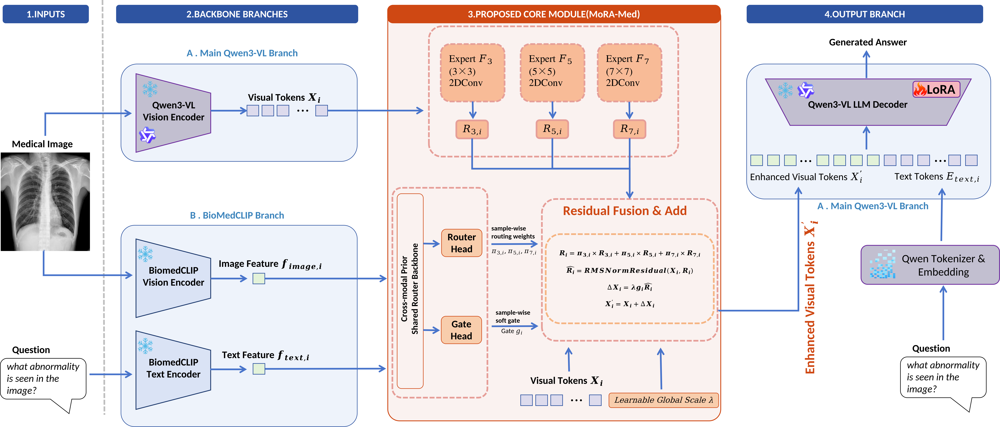
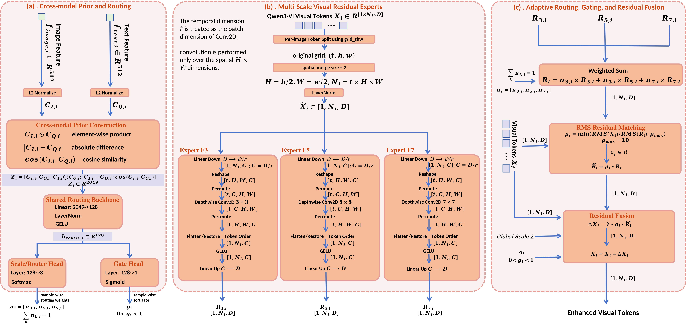
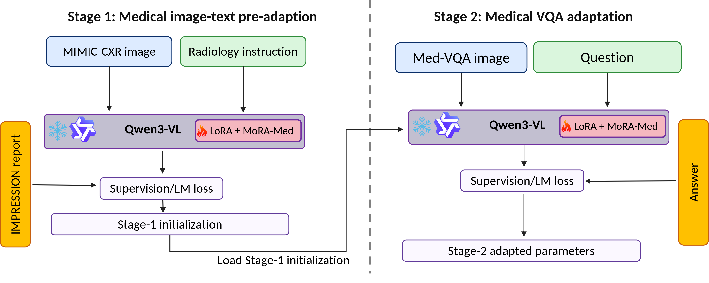

<div align="center">

# MoRA-Med

### Scale-Calibrated Multi-Scale Residual Adaptation for Medical Visual Question Answering

**MoRA-Med** = **Medical-oriented Routing and Residual Adaptation for Medical VQA**

Yuqing Zhou · Pengfei Xu · Qihui Sun · Feng Yan

<p>
  
  
  
  
</p>


</div>

> **Repository branch:** `revision/router-rms-diagnostics`  
> This branch contains the revision-stage residual-scale and Router-only diagnostic implementation. It retains the original experiment pipeline while adding diagnostic logging, Router-only permutation utilities, and summary tooling used in the revised analyses.


## Overview

**MoRA-Med** is a parameter-efficient framework for medical visual question answering (Med-VQA).  
Instead of relying only on low-rank weight adaptation, MoRA-Med explicitly adapts the **frozen visual-token representation** of a pretrained multimodal large language model using lightweight multi-scale residual updates with explicit residual-scale calibration. Image-question-conditioned routing and gating remain components of the implementation.

The current implementation uses:

- **Qwen3-VL-8B-Instruct** as the frozen multimodal backbone.
- **LoRA** for parameter-efficient adaptation of the language/model projections.
- A frozen **BiomedCLIP-PubMedBERT_256-vit_base_patch16_224** model to construct a biomedical image-question prior.
- Three multi-scale residual experts with **3×3, 5×5, and 7×7** depthwise convolutions.
- A question-conditioned **Router** to adaptively combine the residual experts.
- A sample-wise **Gate** and bounded learnable global scale to control residual injection.
- **Capped RMS residual matching** to calibrate the routed residual scale under a bounded amplification factor.
- A **two-stage adaptation strategy**: MIMIC-CXR pre-adaptation followed by downstream Med-VQA adaptation.

<p align="center">
  
</p>

<p align="center">
  <em>Overall architecture of MoRA-Med.</em>
</p>

## Highlights

- **Multi-scale visual residual adaptation.** Lightweight residual experts explicitly modify frozen visual-token representations.
- **Image-question-conditioned soft routing.** Three receptive-field experts are combined through sample-specific weights; weight variation alone does not establish an independent accuracy benefit.
- **Controlled residual injection.** A learned Gate, bounded global scale, and RMS matching regulate how strongly the adapted residual modifies frozen visual tokens.
- **Parameter efficiency.** The MoRA-Med visual branch adds **6.58M trainable parameters**, corresponding to only **3.77%** over the LoRA-only baseline.
- **Paired multi-seed evaluation.** Experiments use seeds **1024, 2048, and 4096** under matched Stage-1/Stage-2 conditions.

## Method

### Detailed Visual Adaptation Module

<p align="center">
  
</p>

<p align="center">
  <em>Detailed architecture of the MoRA-Med visual adaptation module.</em>
</p>

MoRA-Med contains three main components.

### 1. BiomedCLIP-conditioned cross-modal prior

For each image-question pair, frozen BiomedCLIP image and text encoders produce normalized modality-specific embeddings. The routing prior concatenates:

- image features,
- text features,
- element-wise image-text interactions,
- absolute image-text differences,
- cosine similarity.

The resulting prior is processed by a shared routing backbone and mapped to:

- a three-way routing distribution over the multi-scale experts, and
- a sample-wise residual Gate.

### 2. Multi-scale visual residual experts

The frozen Qwen3-VL visual tokens are passed through three lightweight bottleneck residual experts with spatial kernels:

| Expert | Kernel | Role |
|---|---:|---|
| F3 | 3×3 | Fine/local receptive field |
| F5 | 5×5 | Intermediate receptive field |
| F7 | 7×7 | Wider receptive field |

The implementation uses a visual hidden dimension of **4096** and a bottleneck ratio of **16**, giving a latent expert dimension of **256**.

### 3. Adaptive routing, gating, and residual fusion

The Router predicts sample-specific soft weights over F3/F5/F7. When enabled, capped RMS residual matching calibrates the routed residual magnitude before it is modulated by:

- sample-wise Gate `g`,
- bounded learnable global scale `lambda`.

The adapted representation preserves the pretrained visual stream through an identity residual connection.

RMS matching is scale calibration with bounded amplification, not a guarantee that every stream has an identical residual-to-input ratio or reduced sample-wise variance. The coefficient `lambda * g` is distinct from the actual injected-residual magnitude.

## Two-Stage Training

<p align="center">
  
</p>

<p align="center">
  <em>Two-stage parameter-efficient adaptation pipeline.</em>
</p>

### Stage 1: Medical image-text pre-adaptation

Stage 1 uses a fixed **160k-study MIMIC-CXR** subset with one deterministically selected image per study. A chest X-ray image and a fixed radiology instruction form the model input, while the corresponding **IMPRESSION** report section is used as autoregressive supervision.

Only the LoRA and MoRA-Med parameters are optimized. The base Qwen3-VL model and BiomedCLIP remain frozen.

### Stage 2: Medical VQA adaptation

The Stage-1 initialization is transferred to one of four downstream benchmarks:

- SLAKE
- VQA-RAD
- VQA-Med 2019
- VQA-Med 2021

Each Stage-2 run continues optimizing the parameter-efficient components while keeping Qwen3-VL and BiomedCLIP frozen.

## Main Results

Overall Accuracy (%) over three paired training seeds:

| Dataset | LoRA baseline (A0) | MoRA-Med (A6) | Paired gain | Positive seeds |
|---|---:|---:|---:|---:|
| SLAKE | 87.44 ± 0.51 | **89.40 ± 0.65** | **+1.96 ± 0.57** | 3/3 |
| VQA-RAD | 60.90 ± 0.34 | **62.60 ± 0.56** | **+1.70 ± 0.90** | 3/3 |
| VQA-Med 2019 | 63.80 ± 0.35 | 63.93 ± 1.22 | +0.13 ± 0.90 | 2/3 |
| VQA-Med 2021 | 17.27 ± 3.13 | 17.80 ± 1.06 | +0.53 ± 2.10 | 2/3 |

MoRA-Med shows the clearest and most consistent gains on **SLAKE** and **VQA-RAD**. Performance is largely preserved on **VQA-Med 2019**, while **VQA-Med 2021** shows a modest positive mean change with stronger seed sensitivity.

## Parameter Efficiency

| Model / component | Trainable parameters | Increment vs. A0 |
|---|---:|---:|
| A0: Qwen3-VL + LoRA | 174,587,904 | — |
| MoRA-Med visual branch | 6,584,069 | +6,584,069 |
| A6: Full MoRA-Med | 181,171,973 | **+3.77%** |

> The numbers above describe **trainable-parameter efficiency**, not total runtime cost. BiomedCLIP remains frozen but is still executed to construct the cross-modal prior, and the residual experts/Router/Gate introduce additional computation.

## Ablation Configurations

The repository contains the controlled A0-A6 ablation family used in the paper:

| ID | Configuration |
|---|---|
| A0 | Pure LoRA baseline |
| A1 | MoRA-Med without discriminative learning rates (DLR) |
| A2 | MoRA-Med without RMS residual matching |
| A3 | MoRA-Med with fixed `lambda = 0.9` |
| A4 | MoRA-Med with fixed `g = 0.5` |
| A5 | MoRA-Med with uniform routing weights `(1/3, 1/3, 1/3)` |
| A6 | Full MoRA-Med |

## Repository Structure

```text
MoRA_Med/
├── README.md
├── requirements.txt
├── figures/
│   ├── framework.png
│   ├── framerwork_detail.png
│   ├── two_stage_training.png
│   └── routing_samples_40.png
├── config/
│   ├── LLM_config.py
│   ├── stage1_train_config_mimic_cxr.py
│   ├── slake/
│   ├── vqa_rad/
│   ├── vqa_med_2019/
│   └── vqa_med_2021/
├── datas/
│   ├── mimic_cxr_datasets.py
│   ├── slake_datasets.py
│   ├── vqa_rad_datasets.py
│   ├── vqa_med_2019_datasets.py
│   └── vqa_med_2021_datasets.py
├── training/
│   ├── stage1_trainer_mimic_cxr.py
│   ├── stage2_trainer_slake.py
│   ├── stage2_trainer_vqa_rad.py
│   ├── stage2_trainer_vqa_med_2019.py
│   └── stage2_trainer_vqa_med_2021.py
├── evaling/
│   ├── stage2_validate_checkpoints_slake.py
│   ├── stage2_test_checkpoints_slake.py
│   ├── stage2_validate_checkpoints_vqa_med_2019.py
│   ├── stage2_test_checkpoints_vqa_med_2019.py
│   ├── stage2_validate_checkpoints_vqa_med_2021.py
│   ├── stage2_test_checkpoints_vqa_med_2021.py
│   └── stage2_test_checkpoints_vqa_rad.py
├── utils/
│   ├── biomedclip/
│   ├── data_tools/
│   ├── ddp/
│   ├── evaluation/
│   │   └── router_shuffle.py
│   ├── qwen3vl/
│   └── training/
├── LLM_api/
│   ├── deepseek.py
│   └── prompts/
└── other/
    ├── summarize_slake_diagnostics.py
    ├── generate_mimic_cxr_cache.py
    ├── generate_mimic_cxr_cache_subset_same_format.py
    ├── generate_test_official_jsonl.py
    ├── generate_vqa_med_2021_jsonl.py
    └── ...
```

> `evaling/` is the directory name used by the current code release.

## Installation

### 1. Clone the repository

```bash
git clone https://github.com/zhouyuqingaic-dotcom/MoRA_Med.git
cd MoRA_Med
git checkout revision/router-rms-diagnostics
```

For the revised diagnostics, check out the published revision commit or tag documented with the paper. The selected version must contain `utils/evaluation/router_shuffle.py` and `other/summarize_slake_diagnostics.py`; a pre-diagnostic version does not provide these commands.

### 2. Create the Python environment

The experiments reported in the paper were run with **Python 3.11.15**.

```bash
conda create -n mora-med python=3.11.15 -y
conda activate mora-med
python -m pip install --upgrade pip
```

### 3. Install the CUDA-enabled PyTorch build

The reference environment uses **PyTorch 2.10.0+cu130** and
**torchvision 0.25.0+cu130**:

```bash
python -m pip install \
  torch==2.10.0+cu130 \
  torchvision==0.25.0+cu130 \
  --index-url https://download.pytorch.org/whl/cu130
```

### 4. Install FlashAttention

The default Qwen3-VL configuration uses:

```text
attn_implementation = "flash_attention_2"
```

Install the same FlashAttention version used in the reference environment
after PyTorch is available:

```bash
python -m pip install flash-attn==2.8.3 --no-build-isolation
```

### 5. Install the remaining dependencies

```bash
python -m pip install -r requirements.txt
```

`requirements.txt` pins the main runtime dependencies used by this release.
In particular, the Transformers dependency is pinned to the exact development
commit used in the experiments:

```text
ca960f0cc0d2c2549b0f1834a51fa91230e50134
```

Because this dependency is installed directly from the Hugging Face
Transformers Git repository, `git` must be available in the environment.

### Reference experiment environment

| Component | Version / configuration |
|---|---|
| Python | 3.11.15 |
| PyTorch | 2.10.0+cu130 |
| PyTorch CUDA runtime | 13.0 |
| torchvision | 0.25.0+cu130 |
| NVIDIA driver | 580.173.02 |
| GPU used for the reported experiments | 2 × NVIDIA A40 (48 GB each) |
| Transformers | 5.3.0.dev0 |
| Transformers commit | `ca960f0cc0d2c2549b0f1834a51fa91230e50134` |
| Accelerate | 1.13.0 |
| PEFT | 0.18.1 |
| bitsandbytes | 0.49.2 |
| FlashAttention | 2.8.3 |
| OpenCLIP | 2.23.0 |

For the closest reproduction of the reported experiments, use the pinned
environment above. If FlashAttention is unavailable, another supported
attention implementation such as `sdpa` or `eager` may allow the code to run,
but that is not the exact reference environment used for the reported results.

## Model Preparation

The current implementation expects local model directories.

### Qwen3-VL

Use:

```text
Qwen3-VL-8B-Instruct
```

and update `model_name_or_path` in the training/evaluation config files.

### BiomedCLIP

Use the frozen checkpoint:

```text
BiomedCLIP-PubMedBERT_256-vit_base_patch16_224
```

and update `biomedclip_path` in the corresponding config files.

The BiomedCLIP loader expects a local checkpoint directory containing the OpenCLIP configuration/weights and the matching PubMedBERT tokenizer files.

## Data Preparation

The current release uses explicit local paths in the config files. **Update all dataset/model/output paths before training.**

### MIMIC-CXR-JPG v2.1.0

Stage 1 expects a layout containing:

```text
mimic-cxr-jpg-2.1.0/
├── mimic-cxr-2.0.0-metadata.csv.gz
├── files/
├── reports/
└── cache/
```

Stage 1 uses MIMIC-CXR-JPG v2.1.0 and a fixed subset of **160,000 distinct studies**. The subset is constructed with data-sampling seed `2048`. After the 160,000 studies are selected, exactly one image is chosen deterministically from each selected study.

The same fixed Stage-1 subset is reused across A0, A6, the ablation variants, and all model-training seeds. The data-sampling seed is therefore separate from the training seeds `1024`, `2048`, and `4096`.

The `IMPRESSION` section of the corresponding radiology report is used as the Stage-1 supervision target.

This subset construction does not use the official MIMIC-CXR split file for split filtering. Keep the experiment-side subset unchanged when reproducing the paired comparisons.

Relevant helpers:

```text
other/generate_mimic_cxr_cache.py
other/generate_mimic_cxr_cache_subset_same_format.py
```

### SLAKE

Expected layout:

```text
SLAKE/Slake1.0/
    train.json
    validate.json
    test.json
    imgs/
```

The experiments use the original **bilingual SLAKE split files** without language-based filtering. Both English (`q_lang="en"`) and Chinese (`q_lang="zh"`) question-answer samples are retained.

The training pipeline removes a sample only when the question is empty or when the answer becomes empty after the project answer-cleaning routine. The original training split contains 9,835 samples; 9,834 remain after this validity check. The validation and test splits contain 2,099 and 2,094 samples, respectively. No language-based resampling or English-only/Chinese-only subset is constructed. Only the training split contributes to parameter optimization; validation is used for checkpoint selection, and test is reserved for final evaluation.

| Split | Samples used | Role |
|---|---:|---|
| Train | 9,834 | Parameter optimization |
| Validation | 2,099 | Checkpoint selection |
| Test | 2,094 | Final evaluation |

Exact English/Chinese counts must be measured from the experiment-side split files, not inferred from the totals. The following optional check prints the source-file language counts and the training counts after the same answer-cleaning check. It does not write files, resample data, or change the training pipeline. Run it from the repository root after setting `SLAKE_ROOT` to the directory containing the three JSON files.

```bash
export SLAKE_ROOT="/path/to/SLAKE/Slake1.0"
python - <<'PYCOUNT'
import json
import os
from collections import Counter
from pathlib import Path
from utils.data_tools.prompt_cleaning.slake_answer_cleaning import (
    slake_answer_train_cleaning,
)

root = Path(os.environ["SLAKE_ROOT"])
for split, filename in [
    ("train", "train.json"),
    ("validation", "validate.json"),
    ("test", "test.json"),
]:
    rows = json.loads((root / filename).read_text(encoding="utf-8"))
    if not isinstance(rows, list):
        raise TypeError(f"Expected a list of records in {filename}")
    languages = lambda items: dict(Counter(
        str(row.get("q_lang", "")).strip().lower() for row in items
    ))
    print(split, "source_total=", len(rows), "source_languages=", languages(rows))
    if split == "train":
        used = [
            row for row in rows
            if str(row.get("question", "")).strip()
            and slake_answer_train_cleaning(str(row.get("answer", "")).strip())
        ]
        print(split, "used_total=", len(used), "used_languages=", languages(used))
PYCOUNT
```

The revision-stage diagnostics use this same SLAKE test split. They do not change dataset membership, language filtering, or checkpoint selection. Router-only permutations are constructed within the explicit language groups.

### VQA-RAD

Expected layout:

```text
VQA-RAD/
├── train.jsonl
├── test_official.jsonl
└── images/
```

A helper for constructing the official test JSONL is provided in:

```text
other/generate_test_official_jsonl.py
```

The experiments use the predefined project training split and the official test split without additional random repartitioning. VQA-RAD does not use a validation-based checkpoint-selection stage; the final model weights after the predefined training schedule are evaluated on the test set.

### VQA-Med 2019

The current config expects the original ImageCLEF-style directory structure:

```text
VQA-Med-2019/
├── train/
│   └── ImageClef-2019-VQA-Med-Training/
│       ├── QAPairsByCategory/
│       └── Train_images/
├── val/
│   └── ImageClef-2019-VQA-Med-Validation/
│       ├── QAPairsByCategory/
│       └── Val_images/
└── test/
    └── VQAMed2019Test/
        ├── VQAMed2019_Test_Questions_w_Ref_Answers.txt
        └── Test_images/
```

The original ImageCLEF training, validation, and test partitions are used without project-level random repartitioning. The training split is used for parameter optimization, the validation split only for checkpoint selection, and the official test split only for final evaluation.

### VQA-Med 2021

The current pipeline consumes:

```text
VQA-Med-2021/jsonl/
├── train.jsonl
├── validation.jsonl
└── test.jsonl
```

The **4,500/500/500** partition is inherited from the source benchmark files; the project does not randomly repartition a combined sample pool.

The JSONL conversion uses the following source files:

- **Training:** `SYSU-HCP/extracted/data/train/label.txt` together with `SYSU-HCP/extracted/data/train/images/`. This local source corresponds to the 4,500-image / 4,500-question-answer VQA-Med 2020 training set reused for VQA-Med 2021 Task 1.
- **Validation:** `VQA-Med-2021-VQAnswering-Task1-New-ValidationSet.txt` together with the official 2021 validation images.
- **Test:** `Task1-VQA-2021-TestSet-Questions.txt` and `Task1-VQA-2021-TestSet-ReferenceAnswers.txt` together with the corresponding test images.

Each converted Task-1 record is keyed by image ID. The conversion script checks image availability and duplicate identifiers, preserves the source annotation order, verifies that test question IDs match the reference-answer IDs, and retains all available non-empty official test references.

The expected converted split sizes are:

- train: 4,500
- validation: 500
- test: 500

No random train/validation/test split is generated by this project, so there is **no dataset-split random seed for VQA-Med 2021**. Training seeds such as `1024`, `2048`, and `4096` control model training and are unrelated to dataset membership.

Conversion/checking utilities:

```text
other/generate_vqa_med_2021_jsonl.py
other/check_vqa_med_2021.py
other/check_vqa_med_2021_collator.py
```


### Dataset Scope of the Diagnostic Analyses

The diagnostic branch does not introduce a new dataset split, language filter, or resampling procedure. It inherits the same dataset membership used by the original experimental implementation.

The SLAKE residual-scale and Router-only diagnostics use the same **2,094-sample bilingual SLAKE test split** used for the original test evaluation. Both English and Chinese samples are retained.

For Router-only question permutation, replacement questions are permuted **within language groups** rather than across languages. Thus, the intervention changes the question supplied to the Router while preserving the language group of each evaluated sample.

## Configuration

Before running experiments, update the local paths in:

```text
config/stage1_train_config_mimic_cxr.py
config/slake/stage2_train_config_slake.py
config/vqa_rad/stage2_train_config_vqa_rad.py
config/vqa_med_2019/stage2_train_config_vqa_med_2019.py
config/vqa_med_2021/stage2_train_config_vqa_med_2021.py
```

At minimum, verify:

- `output_root`
- dataset paths
- `model_name_or_path`
- `biomedclip_path`
- seed / Stage-1 seed
- ablation ID

### Configuration-to-code map

The settings below document the implementation corresponding to Appendix A.2-A.4. The same LoRA/quantization setup is used for A0 and the MoRA-Med variants; the ablation ID controls which adaptation components are enabled or fixed.

| Setting | Configuration / implementation entry point |
|---|---|
| LoRA rank, alpha, dropout, target modules | `lora_r`, `lora_alpha`, `lora_dropout`, `lora_target_modules` in the stage-specific configs; [LoRA wrapper](utils/qwen3vl/qwen3_vl_8B_lora_wrapper.py) |
| Quantized backbone loading | `load_in_4bit`, `bnb_4bit_quant_type`, `bnb_4bit_use_double_quant`, `bnb_4bit_compute_dtype`, `torch_dtype`; [quantized loader](utils/qwen3vl/qwen3_vl_8B_quant_loader.py) |
| Visual residual experts | [Expert implementation](utils/qwen3vl/qwen3_vl_8B_visual_adapter.py) |
| Router, Gate, bounded global scale, RMS matching | [Fusion module](utils/qwen3vl/qwen3_vl_8B_visual_adapters_fusion.py) and [fusion utilities](utils/qwen3vl/qwen3_vl_8B_visual_adapters_fusion_utils.py) |
| Discriminative learning rates | `use_discriminative_lr` and the module-specific learning-rate fields; [optimizer construction](utils/training/discriminative_optimizer.py) |
| Stage-1 initialization of SLAKE Stage 2 | `stage1_seed`, `stage1_use_discriminative_lr`, and the ablation configuration in [SLAKE training config](config/slake/stage2_train_config_slake.py); [SLAKE trainer](training/stage2_trainer_slake.py) |
| Answer scoring and judge requests | [Evaluation](#evaluation) below |

For evaluation, also check `config/slake/stage2_eval_config_slake.py` and the corresponding `stage2_eval_config_*.py` in each benchmark directory. Training and evaluation must point to the intended experiment, seeds, and model directories; editing a training path does not establish that an evaluation config is correct.

## Training

The training scripts are compatible with Hugging Face `Trainer` and are written to support distributed execution through `torchrun`.

Replace `<N>` with the number of GPUs to use. The experiments reported in the paper used **2 GPUs**, i.e. `--nproc_per_node=2`.

### Stage 1: MIMIC-CXR

Full MoRA-Med:

```bash
torchrun --nproc_per_node=<N> \
  training/stage1_trainer_mimic_cxr.py \
  --ablation_id A6 \
  --seed 2048
```

LoRA-only baseline:

```bash
torchrun --nproc_per_node=<N> \
  training/stage1_trainer_mimic_cxr.py \
  --ablation_id A0 \
  --seed 2048
```

For the paired multi-seed protocol, repeat with:

```text
1024, 2048, 4096
```

### Stage 2: SLAKE

The current SLAKE Stage-2 config stores `seed`, `stage1_seed`, and `ablation_id` directly in:

```text
config/slake/stage2_train_config_slake.py
```

Set those fields first, then run:

```bash
torchrun --nproc_per_node=<N> \
  training/stage2_trainer_slake.py
```

### Stage 2: VQA-RAD

```bash
torchrun --nproc_per_node=<N> \
  training/stage2_trainer_vqa_rad.py \
  --ablation_id A6 \
  --seed 2048 \
  --stage1_seed 2048
```

### Stage 2: VQA-Med 2019

```bash
torchrun --nproc_per_node=<N> \
  training/stage2_trainer_vqa_med_2019.py \
  --ablation_id A6 \
  --seed 2048 \
  --stage1_seed 2048
```

### Stage 2: VQA-Med 2021

```bash
torchrun --nproc_per_node=<N> \
  training/stage2_trainer_vqa_med_2021.py \
  --ablation_id A6 \
  --seed 2048 \
  --stage1_seed 2048
```

## Evaluation

### Semantic judge configuration

The scoring chain is:

```text
raw prediction -> dataset-specific normalization -> normalized exact matching
               -> semantic judge for unmatched open-ended answers only
               -> response parsing -> final binary correctness
```

Normalization and exact matching follow deterministic rules. Semantic evaluation uses a **fixed judge configuration and decision rule**; separately executed external judgments are not assumed to be exactly repeatable. The same dataset-specific rules are used for A0, A6, intermediate ablations, and all compared training seeds.

Set the API credentials through environment variables:

```bash
export DEEPSEEK_API_KEY="<YOUR_API_KEY>"
export DEEPSEEK_BASE_URL="https://api.deepseek.com"
export DEEPSEEK_MODEL="deepseek-v4-flash"
export DEEPSEEK_TEMPERATURE="0.0"
export DEEPSEEK_MAX_TOKENS="256"
```

The paper's judge uses `deepseek-v4-flash`, temperature `0`, and at most `256` output tokens. [The client](LLM_api/deepseek.py) explicitly disables thinking and requests a JSON object. These settings are separate from the decoding configuration used to generate the VQA model's answer. **Never commit API keys or other credentials.**

Closed-ended answers are decided by the dataset-specific normalized exact-match rule alone. Open-ended answers that match a normalized reference are already correct and do not require a judge call. For the remaining open-ended answers, **only `score == "correct"` counts as correct**; `partially_correct` and `incorrect` both count as incorrect in the strict accuracy reported in the paper.

### Scoring implementation and traceability

The full system prompt is the `medical_vqa_llm_judge_system_prompt` field in [config/LLM_config.py](config/LLM_config.py). Request construction and retry handling are in [LLM_api/deepseek.py](LLM_api/deepseek.py). Dataset-specific code locations are:

| Dataset | Answer normalization | Judge user prompt and response parser |
|---|---|---|
| SLAKE | [slake_answer_cleaning.py](utils/data_tools/prompt_cleaning/slake_answer_cleaning.py) | [slake_prompt_builder_deepseek.py](LLM_api/prompts/slake_prompt_builder_deepseek.py) |
| VQA-RAD | [vqa_rad_answer_cleaning.py](utils/data_tools/prompt_cleaning/vqa_rad_answer_cleaning.py) | [vqa_rad_prompt_builder_deepseek.py](LLM_api/prompts/vqa_rad_prompt_builder_deepseek.py) |
| VQA-Med 2019 | [vqa_med_2019_answer_cleaning.py](utils/data_tools/prompt_cleaning/vqa_med_2019_answer_cleaning.py) | [vqa_med_2019_prompt_builder_deepseek.py](LLM_api/prompts/vqa_med_2019_prompt_builder_deepseek.py) |
| VQA-Med 2021 | [vqa_med_2021_answer_cleaning.py](utils/data_tools/prompt_cleaning/vqa_med_2021_answer_cleaning.py) | `build_llm_judge_user_prompt` and `parse_llm_judge_response` in the [validation evaluator](evaling/stage2_validate_checkpoints_vqa_med_2021.py) and [test evaluator](evaling/stage2_test_checkpoints_vqa_med_2021.py) |

For SLAKE, VQA-RAD, and VQA-Med 2019, evaluation cleaning standardizes case and whitespace and removes trailing formatting punctuation without semantic rewriting. VQA-Med 2021 additionally canonicalizes common Unicode punctuation/spacing variants. Its reference normalizer retains valid alternative references and removes normalized duplicates. Exact matching succeeds against **any** normalized reference, and the semantic judge receives the available alternative references rather than only the first answer.

For SLAKE, VQA-RAD, and VQA-Med 2019, the judge user message contains `question`, `gt_raw`, `gt_norm`, `pred_raw`, and `pred_norm`. For VQA-Med 2021, `references_raw` and `references_norm` contain the alternative acceptable answers supplied to the judge. The complete prompt text is kept in the code locations above rather than copied into a second independently maintained prompt.

#### Response parsing and failure handling

| Condition | Implemented handling |
|---|---|
| Empty or whitespace-only API content, or a request exception | The client retries according to `retries` and `retry_seconds` in `config/LLM_config.py`; the supplied defaults are 5 attempts and a 2-second delay, with a 60-second request timeout. |
| All client attempts fail | The client returns `"ERROR"`; the response parser assigns `incorrect`. |
| A response has a surrounding Markdown code fence | The parser removes the supported fence before JSON parsing. |
| JSON decoding fails | The parser assigns `incorrect` and keeps a parsing-failure reason. |
| The returned object has a missing or unsupported `score` label | The parser assigns `incorrect`. Accepted labels are `correct`, `partially_correct`, and `incorrect`. |
| A valid parsed label is `partially_correct` | It remains a recorded judge label, but contributes zero to strict accuracy. |

These statements describe the implemented fallback paths; they do not modify the evaluator or redefine previously reported scores.

#### Per-sample records and result files

The evaluators save checkpoint-level `samples.jsonl`, `samples.csv`, and `summary.json`. For example, SLAKE records retain:

| Purpose | Fields |
|---|---|
| Sample identity and original input | `index`, `image_path`, `question`, `question_category` |
| Reference and prediction trace | `gt_raw`, `gt_norm`, `pred_raw`, `pred_norm`, `is_norm_match` |
| Semantic-judge trace | `llm_judge_raw_response`, `llm_judge_score`, `llm_judge_reason` |
| Binary score used by the metric | `final_correct` |
| Available adapter diagnostics | `routing_f3`, `routing_f5`, `routing_f7`, `residual_gate`, `lambda_value`, `effective_residual_scale` |

Judge fields can be null when normalized exact matching resolves a sample or the question is closed-ended. Do not interpret a missing judge response in such a record as a failed API call. `effective_residual_scale` is the coefficient `lambda * g`, not a measurement of the actual injected tensor's RMS magnitude. VQA-Med 2021 additionally saves its multi-reference fields.

Use the run's saved per-sample records to trace a reported accuracy. A later external judge call, even with the same settings, is a separate evaluation pass and does not automatically replace the paper's saved scores. Historical record files need not contain a complete copy of the prompt, request settings, or Git identity; those implementation details are identified through the corresponding code version and the paths above.

### Checkpoint-selection protocol

SLAKE, VQA-Med 2019, and VQA-Med 2021 select the Stage-2 checkpoint using validation performance and then evaluate the selected checkpoint on test. VQA-RAD uses the final model weights after the predefined training schedule, without validation-based selection. **Test performance is never a checkpoint-selection criterion.** Paired A0/A6 runs use the same dataset-specific selection rule for each training seed.

### SLAKE

Run the following commands from the repository root. Set the intended ablation,
training seeds, and local paths in `config/slake/stage2_eval_config_slake.py`
before validation. In the supplied configuration, the no-argument defaults
are **A0 / seed 1024 / Stage-1 seed 1024**, not the A6 diagnostic setting.

Validation checkpoint selection:

```bash
python -m evaling.stage2_validate_checkpoints_slake
```

Test evaluation using the selected checkpoint:

```bash
python -m evaling.stage2_test_checkpoints_slake
```

In this diagnostic implementation, an untagged normal test writes to
`<test_output_dir>/diagnostics/normal/<checkpoint>/`. It does not use the
older `<test_output_dir>/<checkpoint>/` layout. Reusing the same run tag
and checkpoint overwrites the output files in that location.

#### SLAKE residual-scale and routing diagnostics

For A2/A6 residual logging, the three fixed Router-only permutations, saved mappings, and aggregation commands, use [SLAKE Diagnostics](#slake-diagnostics) below. These diagnostics use fixed validation-selected checkpoints; they are not additional training conditions or a checkpoint-selection procedure.

### VQA-Med 2019

```bash
python evaling/stage2_validate_checkpoints_vqa_med_2019.py
python evaling/stage2_test_checkpoints_vqa_med_2019.py
```

### VQA-Med 2021

```bash
python evaling/stage2_validate_checkpoints_vqa_med_2021.py
python evaling/stage2_test_checkpoints_vqa_med_2021.py
```

### VQA-RAD

VQA-RAD follows the predefined training schedule and evaluates the final model weights directly:

```bash
python evaling/stage2_test_checkpoints_vqa_rad.py
```

> The test set is not used for checkpoint selection.

## SLAKE Diagnostics

This section documents the test-time procedures implemented in **`revision/router-rms-diagnostics`**. Use the same SLAKE split, frozen backbone models, evaluation rules, and validation-selection protocol as the original experiment pipeline. No new training or dataset split is involved.

### Scope and selected checkpoints

The reported diagnostics use Stage-1 and Stage-2 training seed `2048`. The A6 Router-only analysis keeps one trained, validation-selected checkpoint fixed. The residual-scale comparison uses the separately trained, validation-selected A2 and A6 models. In the reported SLAKE runs, both experiment directories contain a selected checkpoint named `checkpoint-1845`; **these are different A2/A6 model states despite sharing the same basename**.

Before running, set the correct local paths in `config/slake/stage2_eval_config_slake.py` and check the corresponding validation selection record, `validation/best_checkpoint.json`. The no-argument SLAKE evaluation config is not necessarily the A6/seed-2048 setting; the commands below explicitly select the intended ablation and seeds. Do not select a checkpoint using test accuracy.

| Component | Existing code location |
|---|---|
| Diagnostic test entry point | [evaling/stage2_test_checkpoints_slake.py](evaling/stage2_test_checkpoints_slake.py) |
| Permutation construction, validation, and hashing | [utils/evaluation/router_shuffle.py](utils/evaluation/router_shuffle.py) |
| Separate Router/Gate conditioning and RMS logging | [utils/qwen3vl/qwen3_vl_8B_visual_adapters_fusion.py](utils/qwen3vl/qwen3_vl_8B_visual_adapters_fusion.py) |
| Numerical RMS matching implementation | [utils/qwen3vl/qwen3_vl_8B_visual_adapters_fusion_utils.py](utils/qwen3vl/qwen3_vl_8B_visual_adapters_fusion_utils.py) |
| CSV summaries and RMS plots | [other/summarize_slake_diagnostics.py](other/summarize_slake_diagnostics.py) |

### Collect A6 and A2 residual-scale records

Run from the repository root:

```bash
# A6: full model, RMS matching enabled in the model configuration.
python -m evaling.stage2_test_checkpoints_slake \
  --ablation-id A6 \
  --seed 2048 \
  --stage1-seed 2048 \
  --test-checkpoint-mode best_validation \
  --condition normal \
  --collect-rms \
  --run-tag normal_rms

# A2: separately trained no-RMS model.
python -m evaling.stage2_test_checkpoints_slake \
  --ablation-id A2 \
  --seed 2048 \
  --stage1-seed 2048 \
  --test-checkpoint-mode best_validation \
  --condition normal \
  --collect-rms \
  --run-tag a2_normal_rms
```

`--collect-rms` enables diagnostic **logging only**. It does not enable RMS matching in A2 or disable it in A6. The A2/A6 configuration determines the model's residual-processing path. The A6 raw-to-used comparison is inside one trained model; the A2-to-A6 injection comparison is between separately trained configurations, not an instantaneous RMS switch on one model.

### Router-only question permutations

Only the question used to compute the Router's cross-modal conditioning is replaced. For sample `i`, the Router receives the original image with question `Q[p(i)]`; the Gate, main Qwen3-VL pathway, evaluation question, and ground truth retain the original sample inputs. The routed residual then follows the ordinary path:

```text
Router weights -> routed residual -> RMS matching -> Gate -> global scale -> injection
```

Consequently, the intervention does **not** hold the final injected-residual magnitude fixed. Keeping `g` and `lambda * g` unchanged is not the same as fixing the actual injected tensor.

The mapping is a one-to-one derangement **within explicit dataset language groups**. It prohibits both self-assignment and assignment to a sample with the same normalized question text; every target question is used exactly once within its language group. For mapping validation, `normalize_question` uses Unicode NFKC normalization, case folding, and whitespace collapsing. This check does not rewrite the question actually supplied to BiomedCLIP, and different normalized strings do not guarantee unrelated semantics.

Use the three fixed permutation seeds from the paper:

```bash
for permutation_seed in 12001 12002 12003; do
  python -m evaling.stage2_test_checkpoints_slake \
    --ablation-id A6 \
    --seed 2048 \
    --stage1-seed 2048 \
    --test-checkpoint-mode best_validation \
    --condition router_shuffle \
    --shuffle-seed "${permutation_seed}" \
    --shuffle-language-key auto \
    --run-tag "router_shuffle_${permutation_seed}"
done
```

The values `12001`, `12002`, and `12003` generate alternative input mappings for the **same checkpoint**; they are not additional model-training seeds. The supplied mapping utility detects `q_lang`, `language`, or `lang`; use the actual explicit language metadata, not character-based language guessing or a single-language override for this bilingual experiment.

### Saved mappings and output locations

Without an explicit `--shuffle-map`, the evaluator stores or reuses:

```text
<cfg.test_output_dir>/diagnostics/shuffle_maps/shuffle_seed_12001.json
<cfg.test_output_dir>/diagnostics/shuffle_maps/shuffle_seed_12002.json
<cfg.test_output_dir>/diagnostics/shuffle_maps/shuffle_seed_12003.json
```

An existing mapping can be reused with `--shuffle-map /path/to/shuffle_seed_12001.json`. It is validated against the current dataset. The recorded `shuffle_map_sha256` is computed by `compute_shuffle_map_sha256` from the **canonical JSON payload** (`sort_keys=True`, `ensure_ascii=False`, compact separators), not by hashing the pretty-printed file bytes with `sha256sum`.

Diagnostic results are written below each experiment's existing test output directory. For the reported checkpoint, the layout is:

```text
<A6 test output directory>/
    diagnostics/
        shuffle_maps/
            shuffle_seed_12001.json
            shuffle_seed_12002.json
            shuffle_seed_12003.json
        normal_rms/
            leaderboard.json
            checkpoint-1845/
                samples.jsonl
                samples.csv
                summary.json
                rms_diagnostics.jsonl
        router_shuffle_12001/
            leaderboard.json
            checkpoint-1845/
                samples.jsonl
                samples.csv
                summary.json
        router_shuffle_12002/...
        router_shuffle_12003/...

<A2 test output directory>/
    diagnostics/
        a2_normal_rms/
            leaderboard.json
            checkpoint-1845/
                samples.jsonl
                samples.csv
                summary.json
                rms_diagnostics.jsonl
```

The two test output directories are resolved from the A6 and A2 experiment configurations. The original non-diagnostic test records remain under each experiment's ordinary `test/checkpoint-1845/` path. Keep the original and diagnostic passes distinct. Reusing a diagnostic run tag and checkpoint output path can overwrite that diagnostic run; it is not a mechanism for preserving multiple evaluation passes.

In addition to the scoring fields listed under [Evaluation](#evaluation), diagnostic sample records include `evaluation_condition`, `router_target_index`, and `router_question`. Summary records identify the ablation, training seeds, selected checkpoint, run tag, matching switch, and mapping provenance, including `shuffle_map_path` and `shuffle_map_sha256`.

### RMS definitions, numerical convention, and aggregation unit

For sample `i` and visual stream `s`, the three measured ratios are

$$
r_{\mathrm{raw},i,s}=\frac{\operatorname{RMS}(R^{\mathrm{raw}}_{i,s})}{\operatorname{RMS}(X_{i,s})},\quad
r_{\mathrm{used},i,s}=\frac{\operatorname{RMS}(R^{\mathrm{used}}_{i,s})}{\operatorname{RMS}(X_{i,s})},\quad
r_{\mathrm{inject},i,s}=\frac{\operatorname{RMS}(\Delta X_{i,s})}{\operatorname{RMS}(X_{i,s})}.
$$

Here `X` is the corresponding input stream, `R_raw` is the routed residual before matching, `R_used` is the residual actually used after the model's matching/bypass step, and `delta_X` is the injected residual after gating and global scaling. A6 uses the matched residual as `R_used`; A2 uses its unmodified routed residual. Ratios are calculated **per sample and per stream first**, then summarized across the 2,094 SLAKE test samples for each stream. They are not a single ratio calculated after pooling all dataset tokens.

| Per-record field in `rms_diagnostics.jsonl` | Meaning |
|---|---|
| `stream_name` | `pooled`, `deepstack_0`, `deepstack_1`, or `deepstack_2` |
| `rms_x`, `rms_raw`, `rms_used`, `rms_delta` | RMS magnitudes of the input, raw residual, used residual, and final injected residual |
| `ratio_raw`, `ratio_used`, `ratio_inject` | The three residual-to-input ratios defined above |
| `rho_unclipped`, `rho_applied`, `rho_clipped` | A6 matching coefficient before/after the amplification bound and its activation indicator |
| `use_rms_norm` | Whether matching is actually enabled in that model |

The logger computes plain RMS from detached float32 tensor values without adding the matching epsilon to these magnitude measurements. If the input RMS is zero, its ratios are recorded as null. The matching coefficients are obtained from the same numerical helper used by the actual RMS operation, with `residual_norm_eps=1e-6` and amplification bound `10`. The clipping indicator is `rho_unclipped > 10`. For A2, the `rho_*` fields are null because its model path does not apply RMS matching; no hypothetical matching coefficient is reported.

The summary script reports means and **population standard deviations** (`statistics.pstdev`, divisor `n`) over the valid per-sample values. In particular, `ratio_inject_std` is the within-test-set variability used for the article's supplementary injection-ratio table, not uncertainty across training seeds. This diagnostic SD convention is distinct from the sample SD across three training seeds in the main performance results.

### Aggregate the saved runs

The summary script requires Matplotlib. The supplied `requirements.txt` does not pin it; use the version from the diagnostic plotting environment rather than treating an arbitrary newer installation as the original reference environment. Its installed version can be checked without modifying the repository:

```bash
python -c "import matplotlib; print(matplotlib.__version__)"
```

Set the two variables below to the actual **A6** and **A2** diagnostics directories. They are distinct roots, each ending in `/test/diagnostics`:

```bash
export A6_DIAGNOSTICS_ROOT="/path/to/A6/experiment/test/diagnostics"
export A2_DIAGNOSTICS_ROOT="/path/to/A2/experiment/test/diagnostics"

python other/summarize_slake_diagnostics.py \
  --diagnostics-root "${A6_DIAGNOSTICS_ROOT}" \
  --a2-diagnostics-root "${A2_DIAGNOSTICS_ROOT}" \
  --normal-tag normal_rms \
  --a2-tag a2_normal_rms \
  --shuffle-prefix router_shuffle_ \
  --checkpoint checkpoint-1845
```

The checkpoint argument above selects an existing output subdirectory for aggregation; it does not perform model selection. It is appropriate to the reported runs, where both selected checkpoint basenames are `checkpoint-1845`. The script's default output directory is `<A6_DIAGNOSTICS_ROOT>/summary`. Supplying the A2 root explicitly avoids searching for A2 records inside the A6 experiment.

The summary script discovers tags by the supplied shuffle prefix. Check that the selected set contains the intended three permutations rather than unrelated reruns sharing that prefix.

| Generated output | Use in the accompanying manuscript |
|---|---|
| `routing_control_summary.csv` | Normal, each Router-only permutation, their mean, and differences relative to that Normal pass; source for Table 8 |
| `rms_summary_by_stream.csv` | Per-stream means, SDs, and matching coefficients/clipping rates; source for Table 7 and supplementary injection-ratio statistics |
| `rms_raw_vs_used_by_stream.png` | A6 raw versus used residual scale; first panel of Figure 4 |
| `rms_injection_a2_vs_a6_by_stream.png` | Injected-residual scale of separately trained A2/A6 models; second panel of Figure 4 |
| `summary_manifest.json` | Paths and selected run tags used by the aggregation script |

`summary_manifest.json` is an existing script output in the experiment output tree, not a request to add a new repository material directory. The extended 40-sample visualization below is **not** produced by this aggregation command.

### Consistency checks and interpretation limits

Use aligned `samples.csv` or `samples.jsonl` records to check image/question/ground-truth identity, `residual_gate`, `lambda_value`, `effective_residual_scale`, Router weights, generated predictions, and final labels separately. An unchanged mean Gate is not a substitute for a sample-wise isolation check. Likewise, a changed final correctness label does not by itself prove that the generated answer changed, because each diagnostic condition executes external semantic judging again.

The paper keeps the original main-experiment evaluation and the diagnostic Normal re-evaluation as distinct passes. Compute permutation accuracy differences against the **Normal pass of the diagnostic protocol**, not against the original ablation-table value. The complete numerical evaluation/intervention audit remains in the paper; the aggregation script is not a replacement for that paired audit.

The observed permutations do not establish a consistent accuracy decrease for the evaluated checkpoint. This does not demonstrate Router ineffectiveness, statistical equivalence, unchanged predictions, or superiority of incorrect questions. The Gate and main model still receive the original question. RMS matching characterizes scale calibration with bounded amplification; neither a narrow `lambda * g` distribution nor the A2/A6 comparison establishes universally reduced injection variability or an independent causal explanation of the accuracy gain.

### Extended sample-level routing visualization

The following figure reproduces the **existing descriptive analysis** of 40 selected SLAKE test examples from the seed-2048 validation-selected A6 checkpoint (the manuscript's extended routing visualization, formerly Appendix C.4 / Figure C.8). It is not a newly generated Router-only permutation result and is not regenerated by `summarize_slake_diagnostics.py`.


**Extended sample-level routing diagnostics.** Panels (a) and (b) show selected examples 1-20 and 21-40. Columns report the three Router weights F3, F5, and F7, Gate `g`, and effective residual coefficient `lambda * g`. Relative expert weights vary across image-question pairs, while `g` and `lambda * g` stay within comparatively narrow coefficient-level ranges. The final column is a modulation coefficient, not a stream-wise measurement of actual injection magnitude.

The heatmap is supporting behavioral evidence, not a partition of experts into fixed semantic roles. Neither a dominant expert weight nor a non-uniform distribution is a calibrated confidence score, evidence of a specific clinical concept assigned to an expert, or a causal explanation of prediction correctness. **Chinese-language text is translated into English for visualization only; all model training and evaluation use the original dataset text.**

## Key Default Hyperparameters

The configuration below is common to the controlled comparisons except for the designated A0-A6 ablation changes. Qwen3-VL's base parameters and BiomedCLIP remain frozen; only the enabled LoRA and MoRA-Med adaptation parameters are optimized.

| Setting | Value |
|---|---|
| Qwen3-VL backbone | `Qwen3-VL-8B-Instruct` |
| Frozen BiomedCLIP checkpoint | `BiomedCLIP-PubMedBERT_256-vit_base_patch16_224` |
| 4-bit loading | `load_in_4bit=True` |
| Quantization type | `bnb_4bit_quant_type="nf4"` |
| Double quantization | `bnb_4bit_use_double_quant=True` |
| Quantized compute dtype | `bnb_4bit_compute_dtype="bfloat16"` |
| Backbone loading dtype | `torch_dtype="bfloat16"` |
| LoRA rank / alpha / dropout | `64` / `128` / `0.05` |
| LoRA attention targets | `q_proj`, `k_proj`, `v_proj`, `o_proj` |
| LoRA feed-forward targets | `gate_proj`, `up_proj`, `down_proj` |
| Visual hidden dimension | `4096` |
| Expert bottleneck ratio / latent dimension | `16` / `256` |
| Expert kernels | `3 x 3`, `5 x 5`, `7 x 7` depthwise convolutions |
| Cross-modal prior dimension | `2049` |
| Router backbone hidden dimension | `128` |
| Gate initialization | `gate_init=0.5` |
| Global scale initialization / maximum | `lambda_init=0.9`, `lambda_max=1.0` |
| RMS matching switch | `use_rms_norm=True` for A6; `False` for A2 |
| RMS numerical epsilon | `residual_norm_eps=1e-6` |
| RMS amplification bound | `residual_norm_ratio_clip=10.0` |
| Maximum image longest edge | `1024` pixels |
| Qwen visual spatial merge size | `spatial_merge_size=2` |

The 4-bit storage format, quantized compute dtype, and backbone loading dtype are distinct settings; they do not imply that every tensor or trainable parameter has a single uniform dtype.

### Shared visual module and initialization

The **same MoRA-Med module, with shared parameters**, is applied to the pooled visual output and the deep-stack visual features. In the SLAKE diagnostic logs these streams are named `pooled`, `deepstack_0`, `deepstack_1`, and `deepstack_2`. They are not four independently trained adapter copies. Each expert's up-projection is zero-initialized, so its residual contribution starts approximately at zero and adaptation begins close to the identity mapping.

The frozen BiomedCLIP prior has dimension 2049 and is projected to 128 dimensions before the Router and Gate heads. For the learned-scale configuration, the bounded global coefficient is

$$
\lambda = \lambda_{\max}\,\sigma(a),\qquad \lambda_{\max}=1,\qquad \lambda_0=0.9.
$$

The learned Gate starts at `g = 0.5`. RMS matching acts on the routed residual before the Gate and global coefficient; its amplification is capped at 10. The cap does not guarantee exact RMS equality for every stream.

### Optimization schedule

The following module-specific learning rates apply when DLR is enabled:

| Setting | Stage 1: MIMIC-CXR | Stage 2 |
|---|---:|---:|
| LoRA learning rate | 2e-5 | 1e-5 |
| Expert learning rate | 1e-4 | 3e-5 |
| Router/Gate/global-scale learning rate | 5e-5 | 2e-5 |
| Normalization learning rate | 2e-5 | 1e-5 |
| Weight decay | 0.01 | 0.01 |
| Maximum gradient norm | 1.0 | 1.0 |
| Scheduler | cosine | cosine |

The reported runs use **2 GPUs**. Batch sizes below are **per device**, not effective global batch sizes.

| Stage / dataset | Epochs | Warm-up steps | Per-device batch size | Gradient accumulation |
|---|---:|---:|---:|---:|
| Stage 1: MIMIC-CXR | 1 | 200 | 4 | 2 |
| Stage 2: SLAKE | 3 | 100 | 4 | 1 |
| Stage 2: VQA-Med 2019 | 3 | 100 | 4 | 1 |
| Stage 2: VQA-Med 2021 | 3 | 100 | 4 | 2 |
| Stage 2: VQA-RAD | 10 | 50 | 1 | 2 |

### A1: uniform learning rates and two-stage initialization

For the SLAKE A1 ablation reported in the paper, DLR is disabled in **both** stages. All trainable adaptation parameters use a single learning rate of **2e-5 in Stage 1** and **1e-5 in Stage 2**. Stage 2 inherits the **corresponding A1 Stage-1 model with the same seed**, not an A6 Stage-1 initialization.

Use `--ablation_id A1 --seed 2048` with the Stage-1 training entry point. For SLAKE Stage 2, set `ablation_id="A1"`, `seed=2048`, and `stage1_seed=2048` in `config/slake/stage2_train_config_slake.py`, then use the Stage-2 command in [Training](#training). The A1 configuration disables both `use_discriminative_lr` and `stage1_use_discriminative_lr`, and the Stage-2 uniform `learning_rate` is `1e-5`. Check the resolved Stage-1 source before launching the run; changing only a learning-rate field while leaving the A6 ablation ID/source in place does not reproduce A1.

The learning rates and initialization described here reproduce the protocol reported in Appendix A.4; a current default configuration is not a substitute for the saved settings of an already completed historical run.

## Checkpoint Contents

Training outputs save the Hugging Face/PEFT model state and processor under `final_weights/`.

For MoRA-Med variants with the visual adapter enabled, the visual adaptation module is additionally saved as:

```text
visual_adapter.pt
```

Intermediate Hugging Face checkpoints also save the visual adapter through the training callback.

### Stage-1 to Stage-2 parameter transfer

For a matched two-stage run, load the Stage-1 LoRA parameters and, when the visual branch is enabled, the complete `visual_adapter.pt` state from the same ablation configuration and training seed. The SLAKE trainer loads the visual-adapter state with `strict=True`. The frozen backbone models are loaded from their original pretrained model directories.

Stage-2 optimization is initialized anew: the Stage-1 optimizer and scheduler states are not continued. This is **adaptation-parameter transfer**, not optimizer-state resume. A0 has no enabled MoRA-Med visual branch to transfer. The A1-specific two-stage rule is given in [A1: uniform learning rates and two-stage initialization](#a1-uniform-learning-rates-and-two-stage-initialization).

## Reproducibility Notes

- Main comparisons use paired seeds: `1024`, `2048`, and `4096`.
- A Stage-1 run with seed `s` is transferred only to the matching Stage-2 run with seed `s`.
- The fixed MIMIC-CXR subset is kept identical across model-training seeds.
- Qwen3-VL and BiomedCLIP remain frozen in both stages.
- Dataset-specific answer-normalization rules, semantic-judge configuration, and the final decision rule are kept fixed across model variants and seeds; separately executed judge outputs need not be identical.
- SLAKE, VQA-Med 2019, and VQA-Med 2021 use validation-based checkpoint selection.
- VQA-RAD uses the final model weights under a predefined training schedule.
- Diagnostic permutation seeds `12001`, `12002`, and `12003` are not training seeds.
- Diagnostic accuracy differences use the Normal evaluation from the same diagnostic protocol; do not substitute a result from a different evaluation pass.
- Preserve predictions, judge responses, shuffle maps, and the release commit for traceability. The aggregation script is not a replacement for a sample-wise paired audit.

## Citation

If you find this project useful, please cite the paper.

```bibtex
@article{zhou2026moramed,
  title   = {MoRA-Med: Scale-Calibrated Multi-Scale Residual Adaptation for Medical Visual Question Answering},
  author  = {Zhou, Yuqing and Xu, Pengfei and Sun, Qihui and Yan, Feng},
  year    = {2026},
  note    = {Preprint}
}
```

> The citation entry will be updated with the final publication metadata after publication.

## Acknowledgements

This project builds on the open-source ecosystems around:

- Qwen3-VL
- BiomedCLIP / OpenCLIP
- Hugging Face Transformers and PEFT
- MIMIC-CXR
- SLAKE
- VQA-RAD
- VQA-Med 2019
- VQA-Med 2021

Please follow the original licenses and data-use requirements of all upstream models and datasets.

---

<div align="center">
  <sub>MoRA-Med — scale-calibrated multi-scale visual residual adaptation for parameter-efficient Med-VQA.</sub>
</div>