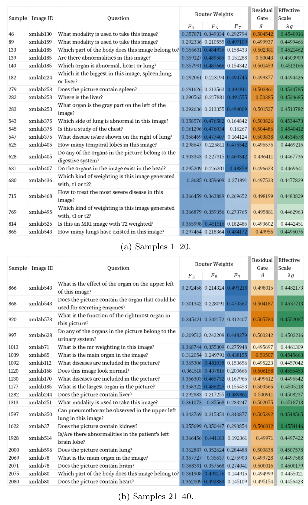

# SLAKE Residual-Scale and Routing Diagnostics

This guide documents the diagnostic implementation in the `revision/router-rms-diagnostics` branch and complements the [branch README](../README.md#slake-diagnostics). It provides the execution, provenance, logging, and aggregation details referenced in Appendix A.6.

The existing descriptive 40-sample routing visualization is documented in [Section 10](#10-extended-sample-level-routing-visualization).

It does not require retraining an existing A2 or A6 model. The evaluation commands
below rerun inference and external semantic judging; the aggregation command
only reads existing outputs.

Run commands from the repository root. Module-style invocation (`python -m`)
keeps project imports resolvable without relying on an IDE's path configuration.

## 1. Scope and prerequisites

Use the matching, validation-selected checkpoints for the separately trained
A2 and A6 configurations. Keep Stage-1 and Stage-2 training seeds aligned.
The examples below use training seed 2048 in both stages.

Update local model, dataset, and output paths in:

```text
config/slake/stage2_train_config_slake.py
config/slake/stage2_eval_config_slake.py
```

The supplied evaluation configuration defaults to A0 / seed 1024 /
Stage-1 seed 1024. Therefore, use the explicit test arguments below for A2/A6.
A2/A6 ablation presets are resolved by the configuration code.

`--test-checkpoint-mode best_validation` reads the corresponding
`validation/best_checkpoint.json`. Preserve that existing selection record
when reproducing an archived run. Do not rerun checkpoint selection merely
to regenerate diagnostics, and do not choose a checkpoint based on test scores.

The validation script reads its configuration file rather than the new test CLI.
When preparing a new run, configure the intended ablation and seeds first:

```bash
python -m evaling.stage2_validate_checkpoints_slake
```

Validation explicitly uses the original question for both Router and Gate,
disables detailed RMS collection, and does not execute Router-only permutations.

A2 and A6 have distinct trained weights. A2 is not produced by disabling RMS
inside an A6 checkpoint.

## 2. Diagnostic plotting dependency

The summarizer imports `matplotlib.pyplot`. The supplied `requirements.txt`
does not declare Matplotlib.

In the environment that generated the archived figures, record the version:

```bash
python -c 'import matplotlib; print("matplotlib==" + matplotlib.__version__)'
```

Add the printed requirement to `requirements.txt` before freezing the release.
Do not obtain this version from an unrelated base environment or invent a pin.
The documentation update does not modify dependencies because the original
Matplotlib version is not recorded in the supplied project.

## 3. A6 Normal with residual-scale logging

```bash
python -m evaling.stage2_test_checkpoints_slake \
  --ablation-id A6 \
  --seed 2048 \
  --stage1-seed 2048 \
  --test-checkpoint-mode best_validation \
  --condition normal \
  --collect-rms \
  --run-tag normal_rms
```

`--collect-rms` controls logging, not the model's RMS-matching setting.
For A6, both Router and Gate use the original image-question pair.

## 4. A2 Normal without model-side RMS matching

```bash
python -m evaling.stage2_test_checkpoints_slake \
  --ablation-id A2 \
  --seed 2048 \
  --stage1-seed 2048 \
  --test-checkpoint-mode best_validation \
  --condition normal \
  --collect-rms \
  --run-tag a2_normal_rms
```

The A2 preset disables model-side RMS matching. Logging remains enabled so
raw, used, and injected residual scales can be measured.

## 5. Router-only question permutations

The original image, main Qwen3-VL question, Gate-conditioning question, and
evaluation question remain unchanged. Only the text input used to construct
the scale Router's cross-modal prior is replaced. The replacement prior uses
the original image and the replacement question; it is not the target
sample's image-question pair.

For these reference commands, 12001/12002/12003 are **permutation seeds**.
They do not denote three new training runs.

```bash
for spec in 01:12001 02:12002 03:12003; do
  shuffle_id="${spec%%:*}"
  shuffle_seed="${spec##*:}"

  python -m evaling.stage2_test_checkpoints_slake \
    --ablation-id A6 \
    --seed 2048 \
    --stage1-seed 2048 \
    --test-checkpoint-mode best_validation \
    --condition router_shuffle \
    --shuffle-seed "${shuffle_seed}" \
    --shuffle-id "${shuffle_id}" \
    --shuffle-language-key auto \
    --run-tag "router_shuffle_${shuffle_id}" || break
done
```

The mapping builder constructs a one-to-one permutation within explicit
language groups, rejects self-mapping and equal normalized question text,
and uses each target once. Question normalization for mapping checks uses
Unicode NFKC normalization, case folding, and whitespace normalization;
it does not replace the actual text passed to BiomedCLIP.

The default `--shuffle-language-key auto` detects `q_lang`, `language`, or
`lang`. A verified single-language input may use `--shuffle-language-key none`.
Do not use `none` merely to bypass missing language metadata for a mixed-language set.

Generated maps are stored under:

```text
<A6 test_output_dir>/diagnostics/shuffle_maps/shuffle_seed_<seed>.json
```

An existing map is loaded and validated rather than regenerated. For an
archived mapping at another location, pass `--shuffle-map` with its path.
The run metadata records the map path, seed, and SHA-256 computed over the
canonical mapping payload. Preserve the original map with the results.

Different normalized question strings need not be semantically unrelated.
This intervention does not remove all question conditioning: the main model
and Gate retain the original question. Router-only intervention requires
learned scale routing and evaluation mode.

## 6. Output layout and overwrite behavior

The current test implementation always uses:

```text
<test_output_dir>/diagnostics/<run_tag>/<checkpoint>/
```

The commands above produce:

```text
<A6 test_output_dir>/
└── diagnostics/
    ├── normal_rms/
    │   ├── leaderboard.json
    │   └── <checkpoint>/
    │       ├── summary.json
    │       ├── samples.csv
    │       ├── samples.jsonl
    │       └── rms_diagnostics.jsonl
    ├── router_shuffle_01/
    ├── router_shuffle_02/
    ├── router_shuffle_03/
    └── shuffle_maps/

<A2 test_output_dir>/
└── diagnostics/
    └── a2_normal_rms/
        ├── leaderboard.json
        └── <checkpoint>/
            ├── summary.json
            ├── samples.csv
            ├── samples.jsonl
            └── rms_diagnostics.jsonl
```

Each shuffle run also contains a leaderboard and checkpoint-level
`summary.json`, `samples.csv`, and `samples.jsonl`. An RMS JSONL is written
only when `--collect-rms` is supplied.

Without an explicit run tag, Normal uses `normal` or `normal_rms`, depending
on `--collect-rms`. Shuffle tags use `router_shuffle_<suffix>`, derived from
the shuffle ID, seed, or mapping filename.

**Reusing a run tag and checkpoint overwrites the files in that location.**
Archive existing results before a rerun or use a separate output root/tag.
If tags change, pass the corresponding tag options to the summarizer.

Unlike the older ordinary-test layout, an untagged Normal run now writes to
`diagnostics/normal/<checkpoint>/`, not directly to `test/<checkpoint>/`.

## 7. Summarize existing outputs

Replace the two absolute paths below with the existing A6 and A2 diagnostic
directories. This step does not rerun models or contact the semantic judge.

```bash
MPLBACKEND=Agg python -m other.summarize_slake_diagnostics \
  --diagnostics-root "/absolute/path/to/A6_RUN/test/diagnostics" \
  --a2-diagnostics-root "/absolute/path/to/A2_RUN/test/diagnostics"
```

The summarizer expects `normal_rms`, `a2_normal_rms`, and at least one
`router_shuffle_` directory by default. It combines routing and RMS summaries;
it is not a standalone RMS-only command.

Default output directory:

```text
<A6 diagnostics root>/summary/
├── routing_control_summary.csv
├── rms_summary_by_stream.csv
├── rms_raw_vs_used_by_stream.png
├── rms_injection_a2_vs_a6_by_stream.png
└── summary_manifest.json
```

Use `--output-dir` for another output directory. Use `--normal-tag`,
`--a2-tag`, and `--shuffle-prefix` when run names differ.

If a run contains multiple checkpoints, pass `--checkpoint` with the intended
directory name. This option applies to all selected runs, including A2.
When each run contains exactly one checkpoint, omit it.

The summarizer discovers all directories matching the shuffle prefix.
Keep unrelated or repeated diagnostic runs outside that prefix/root, or use
a dedicated prefix. Check the manifest's `shuffle_tags` and `num_shuffle_runs`
before interpreting a mean as the three reference permutations.

## 8. Quantities, units, and interpretation

For each sample and visual stream, the log records:

| Field | Meaning |
|---|---|
| `ratio_raw` | RMS of the routed residual before matching / RMS of the input stream |
| `ratio_used` | RMS of the residual actually used after optional matching / RMS of the input stream |
| `ratio_inject` | RMS of `delta = lambda * gate * used_residual` / RMS of the input stream |
| `rho_unclipped` | Epsilon-stabilized RMS scaling factor before the amplification cap |
| `rho_applied` | Scaling factor after the amplification cap |
| `rho_clipped` | Whether the uncapped factor exceeds the configured cap |

Logged residual-to-input ratios use ordinary float32 RMS measurements.
The model's scaling factor uses `sqrt(mean(x**2) + eps)` and the corresponding
residual quantity, then applies the configured upper bound. The logger and
model share that scaling calculation. A2 does not apply RMS matching, so
its rho fields are null. Zero-input-RMS ratios are recorded as null.

Ratios are formed per sample and stream before aggregation. The summarizer
reports means and population standard deviations (`ddof=0`) from finite
recorded values. Its `n` field counts records for the stream.

Accuracy and delta columns in `routing_control_summary.csv` are fractions:
multiply accuracy by 100 for percent and delta by 100 for percentage points.
The RMS ratios are dimensionless; they are not accuracies or contribution
percentages. Multiply clipping fractions by 100 to display a clipping percentage.

The A6 raw-to-used comparison describes processing within one trained model.
The A2-to-A6 injection comparison describes separately trained configurations,
not an instantaneous RMS on/off intervention. A narrow `lambda * gate`
distribution alone does not establish a narrow injection-magnitude distribution.

Routing-weight changes alone do not establish an independent accuracy benefit.
Small aggregate accuracy differences do not establish prediction invariance,
statistical equivalence, or that a Router is generally irrelevant.

## 9. Evaluation provenance and release boundary

Keep original main-experiment results and diagnostic re-evaluations as
distinct evaluation passes. Compute permutation deltas relative to the
Normal result from the corresponding diagnostic protocol, not a Normal
score copied from another pass.

The test evaluator independently invokes the semantic judge for open-ended
answers that fail normalized exact matching. A fixed judge configuration
does not guarantee identical labels across passes. Distinguish changes in
generated answers from changes in final correctness.

The summarizer reads run summaries and RMS logs. It does **not** perform
the complete old-versus-new or Normal-versus-shuffle sample-pair audit.
Such claims require separately retained, aligned `samples.csv`/JSONL records.

Before publishing the paper version, preserve the source commit, dependency
versions, matching checkpoint-selection records, mapping payloads and hashes,
and evaluation records. Public artifacts must respect dataset terms and
must not expose credentials or sensitive local information.

The examples document how to reproduce the diagnostics. Preparing a release
does not require rerunning completed experiments merely to populate new folders.


## 10. Extended sample-level routing visualization

The following figure reproduces the **existing descriptive analysis** of 40 selected SLAKE test examples from the seed-2048 validation-selected A6 checkpoint (the manuscript's extended routing visualization, formerly Appendix C.4 / Figure C.8). It is not a newly generated Router-only permutation result and is not regenerated by `summarize_slake_diagnostics.py`.



**Extended sample-level routing diagnostics.** Panels (a) and (b) show selected examples 1-20 and 21-40. Columns report the three Router weights F3, F5, and F7, Gate `g`, and effective residual coefficient `lambda * g`. Relative expert weights vary across image-question pairs, while `g` and `lambda * g` stay within comparatively narrow coefficient-level ranges. The final column is a modulation coefficient, not a stream-wise measurement of actual injection magnitude.

The heatmap is supporting behavioral evidence, not a partition of experts into fixed semantic roles. Neither a dominant expert weight nor a non-uniform distribution is a calibrated confidence score, evidence of a specific clinical concept assigned to an expert, or a causal explanation of prediction correctness. **Chinese-language text is translated into English for visualization only; all model training and evaluation use the original dataset text.**

### Artifact location and reproduction boundary

The figure asset is located at `figures/routing_samples_40.png` relative to the repository root. The README therefore uses `figures/routing_samples_40.png`, whereas this guide, stored at `docs/diagnostics.md`, uses `../figures/routing_samples_40.png`.

The examples come from the **test split**; validation is used to select the checkpoint, not as the source of the 40 displayed examples. This visualization does not introduce another dataset split, a new accuracy evaluation, or an additional Router-only intervention.

The aggregation command in Section 7 generates the two RMS figures listed there, not this heatmap. The heatmap is retained from the existing descriptive analysis; viewing or retaining it does not require rerunning model inference or external semantic judging. Preserve the existing sample selection and figure provenance rather than replacing it with a newly sampled set.